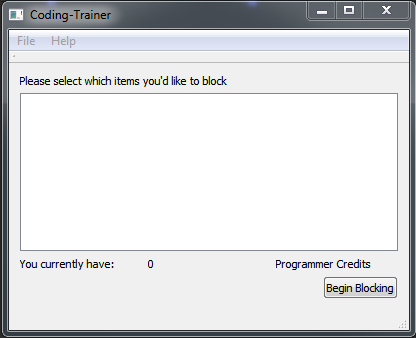

# What is Coding Trainer?

Coding trainer is a project to encourage users to code more. This is done by incentivizing users to work on their code in order to access certain "fun" progrmas.

# How does it work?

The program is a [daemon](https://en.wikipedia.org/wiki/Daemon_(computing)) that monitors opened processes. For example, if the user opens a game, a game client or other specified programs, the application will be forcefully closed and a warning will pop up, such as 
 "This application cannot be loaded. You need 2 more code credits"

# Inspiration

This was inspired the Oasis fitness trainer in the book, Ready Player One. Where Wade had to do a certain amount of exercise daily to enable access to the Oasis, in the end he became healthier and fitter. My plan is to get better at coding by using this idea.

# How can you help?

Fork or email me at Info@IronPhreak.com
 Add your pull request, if it meets standards and adds functionality to the program they will be added.

I welcome any suggestions and ideas

# Coding-Trainer UI

- [ ] Credits will be earned hourly (Determine how many per hour)
- [ ] Credits can then be used to unlock something of particular desire
- [ ] User earns credits per hour
- [ ] Add more options to 'File'
- [ ] Add more to 'Help'
- [ ] Add more menus?
- [ ] Populate white box with programs running currently
- http://doc.qt.io/qt-4.8/qprocess.html
- http://www.bogotobogo.com/Qt/Qt5_QListView_QStringListModel_ModelView_MVC.php
- [ ] Allow user to select the programs in white box
- Can be done by adding a drop down box, refer to bogotobogo link
- [ ] Connect C# with Qt somehow? Or change the framework completely?

Programs required
- Qt\Qt5.7.0\...\qtcreator.exe
  To begin working on this program download from this website
 https://www.qt.io/download-open-source/#section-2
 It is imperative that you have MinGW or some C compiler or this program is rendered useless.
 Another approach is downloading the Qt Designer and working on the UI seperate from the Code.
 The only setback is that there will be no inter connected talking between the *.ui *.cpp and *.h files